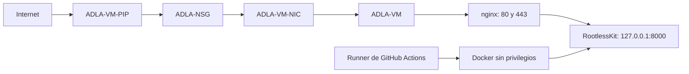

# Runbook de infraestructura de Azure IaaS

Este documento permite reconstruir la infraestructura que hospeda la aplicación Django de `Residencial-La-Antigua/website` en `arbolesdelaantigua.org`. Está ordenado desde la creación de los recursos de Azure hasta la entrega de la VM al flujo de despliegue.

La configuración de la aplicación, los secretos, Docker Compose, GitHub Actions, las verificaciones posteriores al despliegue y el rollback se documentan en [DEPLOYMENT.md](DEPLOYMENT.md).

## 0. Alcance y decisiones

La plataforma atiende una comunidad de aproximadamente 300 viviendas y tiene poco tráfico esperado. La implementación usa una sola VM para mantener bajos los costos.

Servicios no incluidos:

- Azure Application Gateway
- Azure Web Application Firewall
- Azure Bastion

Controles compensatorios:

- NSG con acceso SSH limitado a una dirección administrativa autorizada.
- Ingreso público limitado a HTTP y HTTPS.
- Autenticación SSH por llave, sin contraseñas ni acceso directo de `root`.
- Actualizaciones de seguridad automáticas.
- Fail2Ban y UFW en la VM.
- nginx como único punto de entrada público, con TLS y límites de solicitudes.
- Docker sin privilegios bajo una cuenta de despliegue dedicada.
- Gunicorn publicado solamente en `127.0.0.1:8000`.

La topología resultante es:



## 1. Requisitos previos

1. Instalar Azure CLI, OpenSSH y Git en el equipo administrativo.
2. Iniciar sesión en Azure y seleccionar la suscripción correcta.
3. Tener acceso administrativo al DNS de `arbolesdelaantigua.org`.
4. Identificar la dirección IPv4 pública desde la que se administrará la VM.
5. Preparar una llave SSH exclusiva para la VM.

Verificar las herramientas y la suscripción:

```bash
# Ejecutar en el equipo administrativo
az version
ssh -V
git --version
az login
az account show --output table
```

Definir valores para los comandos siguientes:

```bash
# Ejecutar en el equipo administrativo
LOCATION="eastus"
ADMIN_SOURCE_IP="<IP_PUBLICA_ADMINISTRATIVA>/32"
SSH_PUBLIC_KEY="<RUTA_A_LA_LLAVE_PUBLICA>"
```

No guardar llaves privadas, contraseñas, tokens ni cadenas de conexión en este repositorio.

## 2. Crear los recursos de Azure

Los comandos de esta sección reproducen los nombres de los recursos actuales.

| Recurso | Nombre |
|---|---|
| Grupo de recursos | `ADLA-RG` |
| Red virtual | `ADLA-VNET` |
| Subred | `ADLA-SNET` |
| Grupo de seguridad de red | `ADLA-NSG` |
| IP pública | `ADLA-VM-PIP` |
| Interfaz de red | `ADLA-VM-NIC` |
| Máquina virtual | `ADLA-VM` |

### 2.1 Grupo de recursos

```bash
# Ejecutar en el equipo administrativo
az group create \
  --name ADLA-RG \
  --location "$LOCATION"
```

### 2.2 Red virtual y subred

```bash
# Ejecutar en el equipo administrativo
az network vnet create \
  --resource-group ADLA-RG \
  --name ADLA-VNET \
  --address-prefixes 10.0.0.0/16 \
  --subnet-name ADLA-SNET \
  --subnet-prefixes 10.0.1.0/24
```

### 2.3 Grupo de seguridad de red

Crear la NSG:

```bash
# Ejecutar en el equipo administrativo
az network nsg create \
  --resource-group ADLA-RG \
  --name ADLA-NSG
```

Permitir SSH solamente desde la dirección administrativa:

```bash
# Ejecutar en el equipo administrativo
az network nsg rule create \
  --resource-group ADLA-RG \
  --nsg-name ADLA-NSG \
  --name ADLA-NSG-ALLOW-SSH \
  --priority 90 \
  --direction Inbound \
  --access Allow \
  --protocol Tcp \
  --source-address-prefixes "$ADMIN_SOURCE_IP" \
  --source-port-ranges '*' \
  --destination-address-prefixes '*' \
  --destination-port-ranges 22
```

Permitir HTTP y HTTPS:

```bash
# Ejecutar en el equipo administrativo
az network nsg rule create \
  --resource-group ADLA-RG \
  --nsg-name ADLA-NSG \
  --name ADLA-NSG-ALLOW-HTTP-HTTPS \
  --priority 100 \
  --direction Inbound \
  --access Allow \
  --protocol Tcp \
  --source-address-prefixes Internet \
  --source-port-ranges '*' \
  --destination-address-prefixes '*' \
  --destination-port-ranges 80 443
```

No crear reglas públicas para `8000`, `5432` ni el socket de Docker. Las reglas predeterminadas de la NSG deniegan los demás accesos entrantes.

### 2.4 IP pública e interfaz de red

```bash
# Ejecutar en el equipo administrativo
az network public-ip create \
  --resource-group ADLA-RG \
  --name ADLA-VM-PIP \
  --sku Standard \
  --allocation-method Static

az network nic create \
  --resource-group ADLA-RG \
  --name ADLA-VM-NIC \
  --vnet-name ADLA-VNET \
  --subnet ADLA-SNET \
  --network-security-group ADLA-NSG \
  --public-ip-address ADLA-VM-PIP
```

### 2.5 Máquina virtual

La implementación actual usa Ubuntu Server 24.04 y el tamaño `Standard_B4als_v2`.

```bash
# Ejecutar en el equipo administrativo
az vm create \
  --resource-group ADLA-RG \
  --name ADLA-VM \
  --nics ADLA-VM-NIC \
  --image Ubuntu2404 \
  --size Standard_B4als_v2 \
  --admin-username Admin-ADLA \
  --authentication-type ssh \
  --ssh-key-values "$SSH_PUBLIC_KEY"
```

Consultar la IP asignada:

```bash
# Ejecutar en el equipo administrativo
az network public-ip show \
  --resource-group ADLA-RG \
  --name ADLA-VM-PIP \
  --query ipAddress \
  --output tsv
```

## 3. Configurar DNS y el primer acceso

Crear o actualizar estos registros DNS para que apunten a `ADLA-VM-PIP`:

- Registro `A` para `arbolesdelaantigua.org`.
- Registro `A` o `CNAME` para `www.arbolesdelaantigua.org`.

Esperar a que ambos nombres resuelvan a la IP pública antes de solicitar certificados TLS.

Conectarse por primera vez:

```bash
# Ejecutar en el equipo administrativo
ssh -i <RUTA_A_LA_LLAVE_PRIVADA> Admin-ADLA@<IP_PUBLICA>
```

Mantener esta sesión abierta mientras se prueba el endurecimiento de SSH. Una segunda sesión confirma que el acceso sigue funcionando antes de cerrar la primera.

## 4. Actualizar y endurecer Ubuntu

### 4.1 Parches iniciales

```bash
# Ejecutar en ADLA-VM
sudo apt update
sudo apt full-upgrade -y
sudo apt install -y unattended-upgrades apt-listchanges ca-certificates curl gnupg ufw fail2ban
sudo reboot
```

Volver a conectarse después del reinicio.

### 4.2 Actualizaciones automáticas

Configurar la revisión diaria de paquetes:

```bash
# Ejecutar en ADLA-VM
sudo tee /etc/apt/apt.conf.d/20auto-upgrades >/dev/null <<'EOF'
APT::Periodic::Update-Package-Lists "1";
APT::Periodic::Download-Upgradeable-Packages "1";
APT::Periodic::Unattended-Upgrade "1";
APT::Periodic::AutocleanInterval "7";
EOF
```

Definir la política local:

```bash
# Ejecutar en ADLA-VM
sudo tee /etc/apt/apt.conf.d/52unattended-upgrades-local >/dev/null <<'EOF'
Unattended-Upgrade::Allowed-Origins {
  "${distro_id}:${distro_codename}";
  "${distro_id}:${distro_codename}-security";
  "${distro_id}ESMApps:${distro_codename}-apps-security";
  "${distro_id}ESM:${distro_codename}-infra-security";
};
Unattended-Upgrade::Remove-Unused-Kernel-Packages "true";
Unattended-Upgrade::Remove-New-Unused-Dependencies "true";
Unattended-Upgrade::Automatic-Reboot "true";
Unattended-Upgrade::Automatic-Reboot-Time "03:30";
Unattended-Upgrade::SyslogEnable "true";
EOF

sudo unattended-upgrade --dry-run --debug
sudo systemctl enable --now unattended-upgrades
```

El reinicio automático ocurre a las `03:30` según la zona horaria de la VM. Confirmar que esa hora esté fuera del periodo de uso esperado.

### 4.3 SSH

Crear un archivo separado para no editar la configuración distribuida por Ubuntu:

```bash
# Ejecutar en ADLA-VM
sudo tee /etc/ssh/sshd_config.d/99-adla-hardening.conf >/dev/null <<'EOF'
PermitRootLogin no
PasswordAuthentication no
KbdInteractiveAuthentication no
PubkeyAuthentication yes
MaxAuthTries 3
AllowUsers Admin-ADLA
EOF

sudo sshd -t
sudo systemctl reload ssh
```

Abrir una segunda conexión SSH y confirmar el acceso por llave antes de cerrar la sesión original. Si `sshd -t` falla, corregir el archivo y no recargar el servicio.

### 4.4 UFW

```bash
# Ejecutar en ADLA-VM
sudo ufw default deny incoming
sudo ufw default allow outgoing
sudo ufw allow OpenSSH
sudo ufw allow 'Nginx Full'
sudo ufw enable
sudo ufw status verbose
```

La NSG sigue siendo el control que restringe el origen de SSH. UFW agrega una segunda barrera en el sistema operativo.

### 4.5 Fail2Ban

```bash
# Ejecutar en ADLA-VM
sudo tee /etc/fail2ban/jail.d/adla.local >/dev/null <<'EOF'
[DEFAULT]
bantime = 10m
findtime = 10m
maxretry = 5
backend = systemd

[sshd]
enabled = true
EOF

sudo fail2ban-client -t
sudo systemctl enable --now fail2ban
sudo fail2ban-client status sshd
```

## 5. Crear la cuenta de despliegue

El runner y Docker usan `gha-deploy`. Esta cuenta no tiene contraseña interactiva, acceso SSH ni permisos generales de `sudo`.

```bash
# Ejecutar en ADLA-VM
sudo adduser --disabled-password --gecos '' gha-deploy
sudo passwd -l gha-deploy
sudo loginctl enable-linger gha-deploy

GHA_UID="$(id -u gha-deploy)"
sudo systemctl start "user@${GHA_UID}.service"
loginctl show-user gha-deploy \
  --property=Linger \
  --property=RuntimePath \
  --property=State
```

No agregar `gha-deploy` al grupo `docker`. Ese grupo concede control equivalente a `root` sobre el daemon del sistema y no es necesario para Docker sin privilegios.

La salida de `loginctl` debe incluir `Linger=yes` y `RuntimePath=/run/user/<UID>`. El servicio `user@<UID>.service` proporciona el bus de systemd que necesita el daemon sin privilegios.

## 6. Instalar Docker sin privilegios

### 6.1 Paquetes de Docker

Agregar el repositorio oficial de Docker:

```bash
# Ejecutar en ADLA-VM
sudo install -m 0755 -d /etc/apt/keyrings
curl -fsSL https://download.docker.com/linux/ubuntu/gpg \
  | sudo gpg --dearmor -o /etc/apt/keyrings/docker.gpg
sudo chmod a+r /etc/apt/keyrings/docker.gpg

. /etc/os-release
echo \
  "deb [arch=$(dpkg --print-architecture) signed-by=/etc/apt/keyrings/docker.gpg] https://download.docker.com/linux/ubuntu ${VERSION_CODENAME} stable" \
  | sudo tee /etc/apt/sources.list.d/docker.list >/dev/null

sudo apt update
sudo apt install -y \
  docker-ce \
  docker-ce-cli \
  containerd.io \
  docker-buildx-plugin \
  docker-compose-plugin \
  docker-ce-rootless-extras \
  uidmap \
  dbus-user-session \
  slirp4netns \
  fuse-overlayfs
```

Los paquetes también instalan un daemon con privilegios. Mantenerlo solamente durante la preparación inicial. Primero se debe instalar y validar el daemon sin privilegios; después se debe inventariar y retirar el daemon del sistema.

### 6.2 Daemon de usuario

Verificar que `gha-deploy` tenga rangos subordinados asignados:

```bash
# Ejecutar en ADLA-VM
grep '^gha-deploy:' /etc/subuid
grep '^gha-deploy:' /etc/subgid
```

Ambos comandos deben devolver un rango. Si alguno no devuelve salida, asignar un rango libre antes de continuar; no reutilizar el rango de otra cuenta.

Configurar Docker con el entorno del administrador de usuario de `gha-deploy`:

```bash
# Ejecutar en ADLA-VM
GHA_UID="$(id -u gha-deploy)"
GHA_RUNTIME="/run/user/${GHA_UID}"
GHA_BUS="unix:path=${GHA_RUNTIME}/bus"

sudo -u gha-deploy env \
  HOME=/home/gha-deploy \
  USER=gha-deploy \
  XDG_RUNTIME_DIR="${GHA_RUNTIME}" \
  DBUS_SESSION_BUS_ADDRESS="${GHA_BUS}" \
  PATH=/usr/local/sbin:/usr/local/bin:/usr/sbin:/usr/bin:/sbin:/bin \
  dockerd-rootless-setuptool.sh install

sudo -u gha-deploy env \
  HOME=/home/gha-deploy \
  XDG_RUNTIME_DIR="${GHA_RUNTIME}" \
  DBUS_SESSION_BUS_ADDRESS="${GHA_BUS}" \
  systemctl --user enable --now docker
```

Validar el socket y ejecutar un contenedor desechable antes de retirar el daemon del sistema:

```bash
# Ejecutar en ADLA-VM
GHA_UID="$(id -u gha-deploy)"
GHA_RUNTIME="/run/user/${GHA_UID}"
GHA_BUS="unix:path=${GHA_RUNTIME}/bus"
ROOTLESS_DOCKER="unix://${GHA_RUNTIME}/docker.sock"

sudo -u gha-deploy env \
  HOME=/home/gha-deploy \
  XDG_RUNTIME_DIR="${GHA_RUNTIME}" \
  DBUS_SESSION_BUS_ADDRESS="${GHA_BUS}" \
  DOCKER_HOST="${ROOTLESS_DOCKER}" \
  docker info --format 'Root={{.DockerRootDir}} Security={{json .SecurityOptions}}'

sudo -u gha-deploy env \
  HOME=/home/gha-deploy \
  XDG_RUNTIME_DIR="${GHA_RUNTIME}" \
  DBUS_SESSION_BUS_ADDRESS="${GHA_BUS}" \
  DOCKER_HOST="${ROOTLESS_DOCKER}" \
  docker compose version

sudo -u gha-deploy env \
  HOME=/home/gha-deploy \
  XDG_RUNTIME_DIR="${GHA_RUNTIME}" \
  DBUS_SESSION_BUS_ADDRESS="${GHA_BUS}" \
  DOCKER_HOST="${ROOTLESS_DOCKER}" \
  docker run --detach --rm \
    --name adla-rootless-smoke \
    --publish 127.0.0.1:18080:80 \
    nginx:alpine

curl --fail --show-error http://127.0.0.1:18080/ >/dev/null
sudo ss -lntp | grep ':18080 '

sudo -u gha-deploy env \
  HOME=/home/gha-deploy \
  XDG_RUNTIME_DIR="${GHA_RUNTIME}" \
  DBUS_SESSION_BUS_ADDRESS="${GHA_BUS}" \
  DOCKER_HOST="${ROOTLESS_DOCKER}" \
  docker rm --force adla-rootless-smoke
```

La salida debe incluir `name=rootless`, la raíz de Docker debe estar bajo `/home/gha-deploy` y el puerto temporal debe escuchar solamente en `127.0.0.1:18080`.

Inventariar el daemon con privilegios antes de detenerlo. No continuar si contiene un contenedor, volumen o imagen que deba conservarse:

```bash
# Ejecutar en ADLA-VM
sudo docker --host unix:///var/run/docker.sock ps --all
sudo docker --host unix:///var/run/docker.sock image ls
sudo docker --host unix:///var/run/docker.sock volume ls
sudo docker --host unix:///var/run/docker.sock network ls

ROOT_CONTAINERS="$(sudo docker --host unix:///var/run/docker.sock ps --all --quiet)"
if [ -n "${ROOT_CONTAINERS}" ]; then
  echo 'DETENER: Docker con privilegios todavía contiene contenedores.'
  exit 1
fi
```

Después de confirmar que no hay datos requeridos, retirar los servicios con privilegios. No detener `containerd.service` si otra carga del host lo utiliza:

```bash
# Ejecutar en ADLA-VM
sudo systemctl stop docker.service docker.socket
sudo systemctl disable docker.service docker.socket
sudo systemctl mask docker.service docker.socket

sudo systemctl stop containerd.service
sudo systemctl disable containerd.service
sudo systemctl mask containerd.service

systemctl is-enabled docker.service docker.socket containerd.service || true
systemctl is-active docker.service docker.socket containerd.service || true
test ! -S /var/run/docker.sock && echo 'El socket de Docker con privilegios no existe'
```

Los estados esperados son `masked` e `inactive`. No desinstalar `docker-ce`, `docker-ce-cli`, `containerd.io`, `docker-buildx-plugin`, `docker-compose-plugin` ni `docker-ce-rootless-extras`; el daemon sin privilegios usa esos binarios.

## 7. Instalar y endurecer nginx

### 7.1 Paquetes y configuración global

```bash
# Ejecutar en ADLA-VM
sudo apt install -y nginx certbot python3-certbot-nginx
sudo systemctl enable --now nginx
```

Agregar estas directivas dentro del bloque `http` de `/etc/nginx/nginx.conf`:

```nginx
server_tokens off;
ssl_protocols TLSv1.2 TLSv1.3;
limit_req_zone $binary_remote_addr zone=limit:10m rate=5r/s;
client_max_body_size 10M;
keepalive_timeout 15;
```

### 7.2 Sitio HTTP temporal

Crear un directorio para el desafío de Let's Encrypt:

```bash
# Ejecutar en ADLA-VM
sudo install -d -m 0755 /var/www/certbot/.well-known/acme-challenge
```

Crear `/etc/nginx/sites-available/site`:

```nginx
server {
    listen 80;
    server_name arbolesdelaantigua.org www.arbolesdelaantigua.org;

    location ^~ /.well-known/acme-challenge/ {
        root /var/www/certbot;
    }

    location / {
        return 503;
    }
}
```

Activar el sitio:

```bash
# Ejecutar en ADLA-VM
sudo ln -s /etc/nginx/sites-available/site /etc/nginx/sites-enabled/site
sudo rm -f /etc/nginx/sites-enabled/default
sudo nginx -t
sudo systemctl reload nginx
```

### 7.3 Certificados TLS

Solicitar el certificado después de confirmar que ambos nombres DNS apuntan a la VM:

```bash
# Ejecutar en ADLA-VM
sudo certbot certonly \
  --webroot \
  --webroot-path /var/www/certbot \
  --domain arbolesdelaantigua.org \
  --domain www.arbolesdelaantigua.org

sudo certbot renew --dry-run
```

### 7.4 Sitio HTTPS final

Reemplazar `/etc/nginx/sites-available/site` con la configuración del proxy:

```nginx
server {
    listen 80;
    server_name arbolesdelaantigua.org www.arbolesdelaantigua.org;

    location ^~ /.well-known/acme-challenge/ {
        root /var/www/certbot;
    }

    location / {
        return 301 https://$host$request_uri;
    }
}

server {
    listen 443 ssl;
    server_name arbolesdelaantigua.org www.arbolesdelaantigua.org;

    ssl_certificate /etc/letsencrypt/live/arbolesdelaantigua.org/fullchain.pem;
    ssl_certificate_key /etc/letsencrypt/live/arbolesdelaantigua.org/privkey.pem;
    ssl_protocols TLSv1.2 TLSv1.3;
    ssl_session_cache shared:SSL:10m;
    ssl_session_timeout 1d;

    add_header Strict-Transport-Security "max-age=31536000; includeSubDomains" always;
    add_header X-Frame-Options "SAMEORIGIN" always;
    add_header X-Content-Type-Options "nosniff" always;

    limit_req zone=limit burst=10 nodelay;

    location ~ /\. {
        deny all;
    }

    location / {
        proxy_pass http://127.0.0.1:8000;
        proxy_http_version 1.1;
        proxy_set_header Host $host;
        proxy_set_header X-Real-IP $remote_addr;
        proxy_set_header X-Forwarded-For $proxy_add_x_forwarded_for;
        proxy_set_header X-Forwarded-Proto $scheme;
        proxy_set_header Connection "";
        proxy_connect_timeout 5s;
        proxy_read_timeout 60s;
    }
}
```

Validar antes de recargar:

```bash
# Ejecutar en ADLA-VM
sudo nginx -t
sudo systemctl reload nginx
```

No recargar nginx si la validación falla. El backend puede responder `502 Bad Gateway` hasta que se complete el primer despliegue de la aplicación.

nginx debe sobrescribir `X-Forwarded-Proto` y el contenedor debe permanecer enlazado a `127.0.0.1`. [DEPLOYMENT.md](DEPLOYMENT.md) documenta la configuración correspondiente de Django.

## 8. Instalar el runner autohospedado

En GitHub, abrir **Settings > Actions > Runners**, seleccionar **New self-hosted runner** y elegir Linux X64. El token de registro que muestra GitHub vence y no debe guardarse.

Crear el directorio con la cuenta de despliegue:

```bash
# Ejecutar en ADLA-VM
sudo install -d \
  -m 0750 \
  -o gha-deploy \
  -g gha-deploy \
  /home/gha-deploy/actions-runner-website

sudo -iu gha-deploy
cd /home/gha-deploy/actions-runner-website
```

Ejecutar como `gha-deploy` los comandos de descarga que muestra GitHub. Configurar el runner para este repositorio:

```bash
# Ejecutar como gha-deploy en ADLA-VM
read -r -s -p 'Token nuevo del runner de GitHub: ' RUNNER_TOKEN
echo

./config.sh \
  --url https://github.com/Residencial-La-Antigua/website \
  --token "${RUNNER_TOKEN}" \
  --name ADLA-website-runner \
  --labels adla-production \
  --work _work \
  --unattended \
  --replace

unset RUNNER_TOKEN
exit
```

`/home/gha-deploy` no permite que `Admin-ADLA` cambie directamente a ese directorio. Instalar el servicio desde un shell con privilegios que haga el cambio de directorio internamente:

```bash
# Ejecutar en ADLA-VM
RUNNER_DIR="/home/gha-deploy/actions-runner-website"

sudo /bin/bash -c "cd '${RUNNER_DIR}' && ./svc.sh install gha-deploy"
RUNNER_SERVICE="$(sudo cat "${RUNNER_DIR}/.service")"
```

Crear un drop-in para que el servicio use siempre el socket de Docker sin privilegios, sin depender del contexto interactivo de Docker:

```bash
# Ejecutar en ADLA-VM
GHA_UID="$(id -u gha-deploy)"
RUNNER_DIR="/home/gha-deploy/actions-runner-website"
RUNNER_SERVICE="$(sudo cat "${RUNNER_DIR}/.service")"
DROPIN_DIR="/etc/systemd/system/${RUNNER_SERVICE}.d"

sudo install -d --mode=0755 "${DROPIN_DIR}"

sudo tee "${DROPIN_DIR}/rootless-docker.conf" >/dev/null <<EOF
[Service]
Environment=HOME=/home/gha-deploy
Environment=XDG_RUNTIME_DIR=/run/user/${GHA_UID}
Environment=DBUS_SESSION_BUS_ADDRESS=unix:path=/run/user/${GHA_UID}/bus
Environment=DOCKER_HOST=unix:///run/user/${GHA_UID}/docker.sock
Environment=PATH=/home/gha-deploy/bin:/usr/local/sbin:/usr/local/bin:/usr/sbin:/usr/bin:/sbin:/bin
EOF

sudo chmod 0644 "${DROPIN_DIR}/rootless-docker.conf"
sudo systemctl daemon-reload
sudo systemctl enable --now "${RUNNER_SERVICE}"

sudo systemctl show "${RUNNER_SERVICE}" --no-pager \
  --property=Id \
  --property=User \
  --property=ActiveState \
  --property=Environment \
  --property=ExecStart

sudo journalctl \
  --unit "${RUNNER_SERVICE}" \
  --lines 30 \
  --no-pager \
  --full
```

El usuario debe ser `gha-deploy`, el estado debe ser `active`, `ExecStart` debe apuntar a `/home/gha-deploy/actions-runner-website/runsvc.sh` y `DOCKER_HOST` debe apuntar a `/run/user/<UID>/docker.sock`. El journal debe mostrar que el runner se conectó a GitHub y está escuchando trabajos. Confirmar también que el runner aparece en línea en la configuración del repositorio.

## 9. Validar la infraestructura

### 9.1 Azure

```bash
# Ejecutar en el equipo administrativo
az resource list \
  --resource-group ADLA-RG \
  --query '[].{Name:name,Type:type,Location:location}' \
  --output table

az network nsg rule list \
  --resource-group ADLA-RG \
  --nsg-name ADLA-NSG \
  --output table
```

Confirmar que SSH está limitado a la dirección administrativa y que no existe una regla pública para `8000`.

### 9.2 VM

```bash
# Ejecutar en ADLA-VM
sudo sshd -t
sudo ufw status verbose
sudo fail2ban-client status sshd
sudo systemctl status unattended-upgrades --no-pager
sudo nginx -t
sudo certbot renew --dry-run
sudo ss -lntp | grep -E ':(22|80|443|8000) '

GHA_UID="$(id -u gha-deploy)"
GHA_RUNTIME="/run/user/${GHA_UID}"
GHA_BUS="unix:path=${GHA_RUNTIME}/bus"

sudo -u gha-deploy env \
  HOME=/home/gha-deploy \
  XDG_RUNTIME_DIR="${GHA_RUNTIME}" \
  DBUS_SESSION_BUS_ADDRESS="${GHA_BUS}" \
  DOCKER_HOST="unix://${GHA_RUNTIME}/docker.sock" \
  docker info --format 'Root={{.DockerRootDir}} Security={{json .SecurityOptions}}'

RUNNER_SERVICE="$(sudo cat /home/gha-deploy/actions-runner-website/.service)"
sudo systemctl show "${RUNNER_SERVICE}" --no-pager \
  --property=User \
  --property=ActiveState \
  --property=Environment \
  --property=ExecStart
```

Resultados requeridos:

- SSH, HTTP y HTTPS escuchan en sus puertos esperados.
- El puerto `8000` no escucha en `0.0.0.0` ni en `[::]`.
- `docker.service`, `docker.socket` y `containerd.service` están `masked` e `inactive`, y `/var/run/docker.sock` no existe.
- Docker informa `name=rootless`.
- nginx y la renovación de Certbot validan sin errores.
- El runner está en línea, su servicio corre como `gha-deploy` y su entorno contiene el socket de Docker sin privilegios.

## 10. Entregar la VM al despliegue

La infraestructura queda lista cuando Azure, SSH, UFW, Fail2Ban, actualizaciones automáticas, Docker sin privilegios, nginx, TLS y el runner pasan las verificaciones anteriores.

Continuar en [DEPLOYMENT.md](DEPLOYMENT.md) para configurar los secretos de GitHub, desplegar la imagen, verificar la aplicación y operar el servicio.
